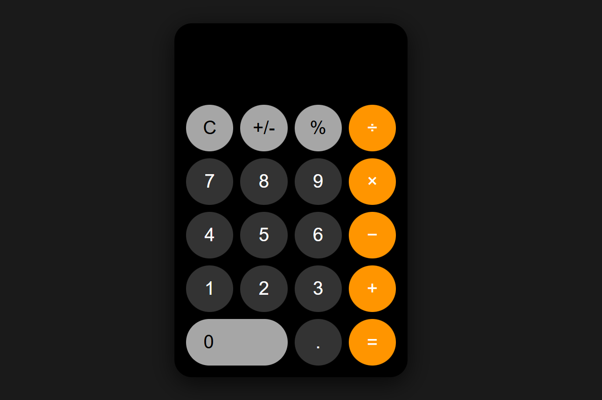

# Apple-Style Calculator

A sleek, Apple-inspired calculator built with **HTML**, **CSS**, and **JavaScript**. This project replicates the minimalist look and feel of the iOS calculator, complete with smooth button interactions, responsive design, and basic arithmetic functionality.

---

## Demo

![Calculator Screenshot]


---

## Features

- Basic arithmetic operations: addition, subtraction, multiplication, division.  
- Percentage calculations.  
- Toggle between positive and negative numbers (+/-).  
- Clear (`C`) functionality.  
- Apple-inspired UI design:
  - Rounded buttons  
  - Color differentiation for operators, numbers, and functions  
  - Responsive layout for mobile screens  
- Smooth button press animation for realistic feedback.  

---

## Technologies

- **HTML** – Structure and layout  
- **CSS** – Styling and Apple-style design  
- **JavaScript** – Calculator logic and button interactions  

---

## Installation

1. Clone this repository:  
```bash
git clone https://github.com/yourusername/apple-calculator.git
